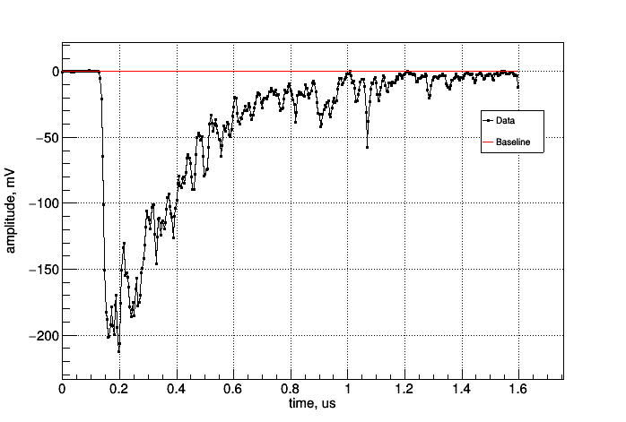
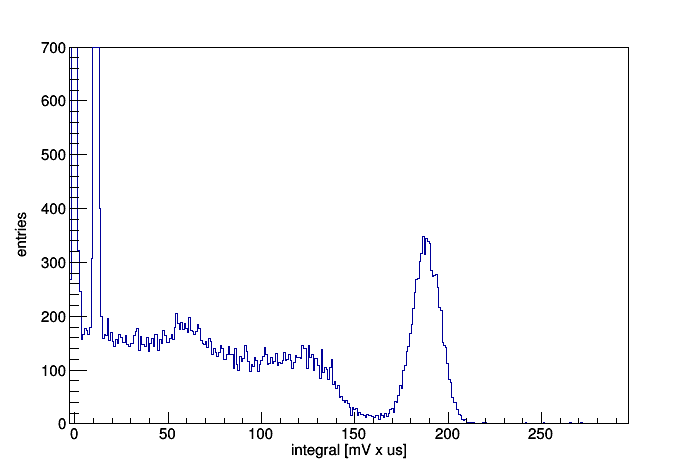

# CAEN WaveDump Binary Parser
This is a C++ library for parsing binary files generated by the [WaveDump](https://www.caen.it/products/caen-wavedump/) software for CAEN digitizers.

# Introduction
This software is intended to provide a simple C++ interface
to work with WaveDump's binary data files. It allows user to extract, store and analyse primary
information about each event recorded in the binary file:
 * Header of a binary file (see WaveDump [documentation](https://www.caen.it/?downloadfile=5056)) (log in required)
 * Data points
 * Time step between two consecutive data points (sample time)
 * ... (for the full list of abilities see the documentation)

Moreover, this software can be easily ''extended''
by user in the following sense. Each event consisting of data points (or a waveform) and 
some additional info is represented by and accessible through the `Event` class (described in the documentation).
This allows user to write his/her own functions to perform any kind of analysis on an event
using only `Event` object which stores a given event.

# Disclaimer
This library is *not* an official CAEN software. Don't use it with ASCII data files produced by the WaveDump software.

# System requirements
## Stand-alone usage
 * gcc >= 4.7

## ROOT-based classes (`CaenTreeCreator`)
 * gcc >= 5.3

# Installation
For the installation process see the documentation (Sec. **Installation**)

# Usage
For the usage see the documentation (Sec. **Usage**)

# Documentation
The documentation is available [here](https://github.com/LRDPRDX/CAEN-Binary-Parser/blob/master/doc/users_guide.pdf)

# Feedback
Report bugs or suggest to paradox1859@gmail.com

# TODO's
- [ ] Add a user-independent algorithm to calculate the baseline
- [ ] Create a class to draw waveforms
- [x] Add a real example of using `CaenTreeCreator` 

# Test plot
As a test you can see the plot of a single signal from the PMT with NaI:Tl crystal on the input
window with Cs137 gamma-source (left image, the code is available
here: `example/ROOT/draw/`) and integral spectrum of those signals (right image, the code for `TTree`
creation is available here: `example/ROOT/create_tree/`):

  
  

